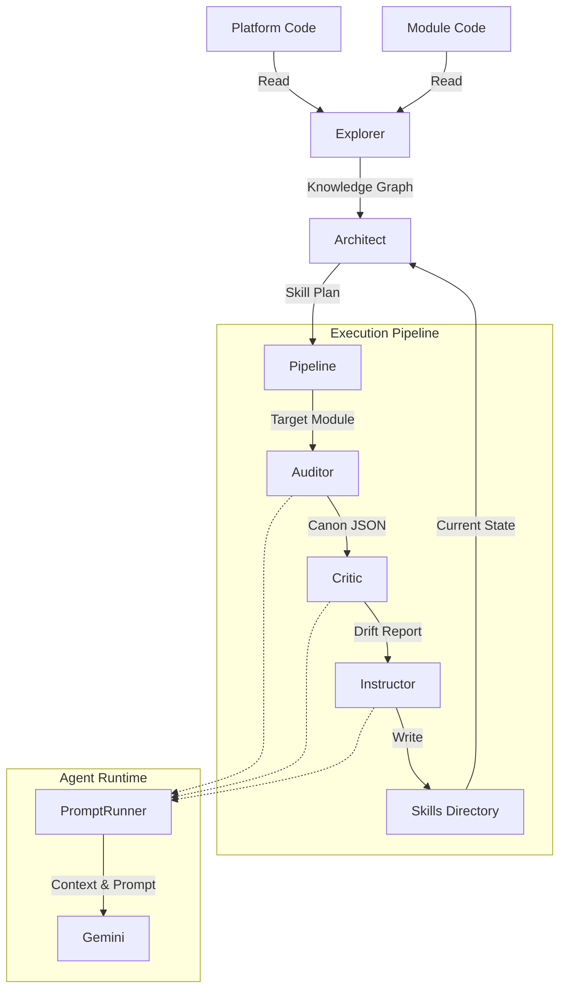

# Reskill Architecture & Specification

**Version**: 1.1.0
**Status**: Stable

**Reskill** is an **Adaptive Learning System** for software projects. Its primary purpose is to decouple the "Intelligence" of a project from its "Implementation", allowing the codebase to "teach itself" how to grow.

In traditional development, "Best Practices" and "Architecture" are static documents that quickly rot. Reskill treats these as living **Skills** that must be continuously evolved by observing the actual code (The Kernel).

**Core Objectives:**

1.  **Automated Alignment**: Ensure "User Space" code (features/modules) stays aligned with "Kernel" code (platform/core).
2.  **Living Documentation**: Automatically generating and updating "Skill Definitions" (guides, templates, patterns) based on the latest source of truth.
3.  **Drift Detection**: Identifying when implementation diverges from the established patterns.

---

## 1. Architectural Pattern: Core, Shell & Registry

Reskill follows a **Core & Shell** architectural pattern:

- **Core (`src/core/`)**: The immutable logic. It contains the data processing pipelines, the file discovery mechanisms, and the orchestration for AI agents. The Core has no knowledge of the specific CLI framework being used.
- **Shell (`src/commands/`)**: The interface layer. It provides the CLI commands (e.g., `learn`, `watch`) using the `@nexical/cli-core` framework. It collects user input and environmental configuration to pass down to the Core.
- **Registry (`.reskill/skills/`)**: The output and execution space. Once skills are generated or updated by the Core, they are bundled here and subsequently symlinked to consumer locations (like `.agent/skills`).

---

## 2. Architecture & The Learning Loop

Reskill operates on a cyclical **Learning Loop**: `Explore -> Strategize -> Execute`.
It continuously aligns implementation with the intended architecture.

### 2.1 The Components

1.  **The Explorer (Discovery)** (Phase 1: Explore)
    - **Role**: The "Senses" of the system.
    - **Function**: Scans the workspace based on the `nexical.yaml` configuration to find targeted projects (identifying `.skills` directories). It maps the file structure, identifies emerging patterns, and builds a **Knowledge Graph**.
    - **Output**: `knowledge-graph.json` detailing the current functional state.

2.  **The Architect (Strategy)** (Phase 2: Strategize)
    - **Role**: The "Brain" of the system.
    - **Function**: The main planner. Compares the newly generated **Knowledge Graph** against the **Current Skills** (the mapped "Skill Portfolio" in `.reskill/skills`). It identifies gaps (missing skills), rot (outdated skills), and redundancy.
    - **Output**: A **Skill Plan** (`create`, `update`, `delete`, `merge`) containing actionable directives.

3.  **The Pipeline (Orchestration)** (Phase 3: Execute)
    - **Role**: The "Nervous System".
    - **Function**: Manages the multi-stage execution flow for each skill identified in the **Skill Plan**.
    - **Stages**:
      1.  **Auditor**: Reads the "Truth" (Core Code) and extracts a generalized set of rules or patterns into a **Canon** (`-canon.json`).
      2.  **Critic**: Compares the Auditor's **Canon** against the existing **Skill Documentation**. It identifies discrepancies and generates a **Drift Report** (`-drift.md`).
      3.  **Instructor**: Reads the Drift Report and performs precise edits to the **Skill Documentation** (`SKILL.md`) and associated templates to bring them into alignment.

4.  **The Agent Runtime (Execution)**
    - **Role**: The "Hands" of the system.
    - **Component**: `AgentRunner` & `PromptRunner`.
    - **Function**: Executes specialized AI prompts using Nunjucks templating and LLM interaction.

### 2.2 Data Flow



---

## 3. The Agent Runtime

The AI execution environment orchestrates LLM interactions and context generation.

### `PromptRunner`

The workhorse for AI interactions. It handles:

- **Templating**: Uses Nunjucks to render dynamic `.md` prompts based on inputs.
- **Context Injection**: Includes custom asynchronous macros like `context()` which uses `repomix` to dynamically bundle and inject massive codebase context (XML format) into prompts on-the-fly.
- **Model Rotation**: Implements a failover strategy (e.g., trying `gemini-3-pro-preview` and falling back to `gemini-3-flash-preview` on rate limits or errors).
- **Interactive Mode**: Supports human-in-the-loop refinement for complex agent outputs.

### Prompts Directory Structure

Prompts are resolved in a hierarchical fallback pattern to allow user overrides:

1.  **User Override**: `.agent/prompts/{agent}.md` (Local workspace)
2.  **Platform Default**: `prompts/{agent}.md` (Inside the `@nexical/reskill` package)
3.  **Initialized State**: `.reskiller/prompts/{agent}.md`

---

## 4. Subsystems

- **`Bundler`**: Aggregates distributed `.skills` directories from individual projects into single, flattened `.reskill/skills` directory, resolving naming collisions.
- **`Symlinker`**: Distributes the bundled skills to end-user environments (creating symlinks in `.gemini/`, `.agent/`, `.claude/`, etc.) based on `nexical.yaml` configuration.
- **`Initializer`**: Ensures the workspace is properly scaffolded on the first run of any Reskill command.

---

## 5. Constraints

To function correctly, Reskill imposes the following constraints on the target codebase:

1.  **Distinct Kernel vs. User Space**: Behavior must be separable into "Truth" (Core/Platform) and "Implementation" (Modules/Apps).
2.  **Constitution Files**: The system requires a `constitution.architecture` file (e.g., `ARCHITECTURE.md`) to ground its reasoning.
3.  **Structured Skills**: Skills are strictly organized as directories inside `.skills` folders in each project. They are aggregated into a flattened structure: `.reskill/skills/{project-name}-{skill}/SKILL.md`.
4.  **Agent Environment**: The system relies on `gemini` CLI being available in the environment (or mocked via `PromptRunner`).

---

## 6. Configuration

Reskill is configured via the `reskill` key in `nexical.yaml` (or the project's central configuration).

### Schema (`ReskillConfig`)

| Field                       | Type                 | Description                                                                  |
| :-------------------------- | :------------------- | :--------------------------------------------------------------------------- |
| `constitution`              | `object`             | References to global governance documents.                                   |
| `constitution.architecture` | `string`             | Path to the main architecture doc (required).                                |
| `constitution.patterns`     | `string \| string[]` | Path(s) to coding standards (optional).                                      |
| `discovery`                 | `object`             | Defines the scope of the scanner.                                            |
| `discovery.root`            | `string`             | Root directory to scan from. Default: `.`.                                   |
| `discovery.markers`         | `string[]`           | Directory names that indicate a "Skill Project". Default: `['.skills']`.     |
| `outputs`                   | `object`             | Where to inject the skill index.                                             |
| `outputs.contextFiles`      | `string[]`           | Files to update with the list of skills (e.g., `GEMINI.md`, `.cursorrules`). |

---

## 7. Extension

Reskill is designed to be extensible through **Prompt Overrides** and **Hooks**.

### 7.1 Dynamic Prompts

You can customize the "Personality" of the agents by overriding their system prompts.

1.  Create `.agent/prompts/agents/`.
2.  Add a markdown file matching the agent name (e.g., `auditor.md`, `architect.md`).
3.  Reskill will prioritize your local file over the bundled default.

### 7.2 The Hooks System

The **Hooks System** allows plugins to react to lifecycle events.

**Location**: `src/core/Hooks.ts` (Internal API).

**Available Hooks**:

- `onDriftDetected(target, driftFile)`: Fired when the Critic finds discrepancies.
- `onSkillUpdated(target)`: Fired after the Instructor completes a rewrite.

---

## 8. Usage

Reskill automatically initializes its environment (scaffolds directories and copies prompts) on the first execution of any command.

### CLI Commands

#### `nexical skill learn`

```bash
nexical skill learn
```

- Runs the full learning loop.
- Best for CI/CD pipelines or nightly builds.
- Updates all skills based on the current architectural patterns.

#### `nexical skill watch` (Pro)

```bash
nexical skill watch
```

- Runs as a daemon, watching for file changes.
- Incrementally triggers drift detection when core files change and updates relevant skills.

---

## 9. Directory Structure Overview

```text
packages/reskill/
├── src/
│   ├── agents/          # Execution wrappers for LLM interaction
│   │   ├── AgentRunner.ts
│   │   └── PromptRunner.ts
│   ├── commands/        # CLI implementations (The Shell)
│   │   ├── init.ts
│   │   └── skill/
│   │       ├── learn.ts
│   │       └── watch.ts
│   ├── core/            # The Brain and Nervous System (The Core)
│   │   ├── Architect.ts
│   │   ├── Explorer.ts
│   │   ├── Pipeline.ts
│   │   ├── ProjectScanner.ts
│   │   └── ...
│   ├── config.ts        # Configuration parsing (Zod)
│   └── types.ts         # Shared interfaces
├── prompts/             # Default Agent Instructions
└── ARCHITECTURE.md      # Architecture and functional specification (this file)
```

---

## 10. Codebase Canon & Implementation Patterns

To ensure consistency and maintainability, Reskill enforces the following implementation patterns (The Canon):

### 10.1 Agent Runner Pattern

- **Description**: Agents are stateless, static service classes.
- **Rule**: Agents MUST be classes with a `static async run()` method.
- **Implementation**: They MUST delegate actual LLM interaction to `PromptRunner` or `AiClient`.
- **Export**: Agents MUST use Named Exports.

### 10.2 Core Service Pattern

- **Description**: Core logic is encapsulated in classes with dependency injection.
- **Rule**: Services MUST be classes receiving configuration/dependencies via the constructor.
- **Export**: Services MUST use Named Exports.

### 10.3 CLI Command Structure

- **Description**: Commands extend the base CLI framework.
- **Rule**: Commands MUST extend `BaseCommand` from `@nexical/cli-core`.
- **Initialization**: Commands MUST initialize the logger (`logger.setCommand(this)`) at the start of `run()`.
- **Export**: Commands MUST be `default` exported.

### 10.4 Strict ESM & Hygiene

- **Imports**: All local imports MUST use the `.js` extension (e.g., `import { x } from './file.js'`).
- **Node Built-ins**: MUST use the `node:` protocol prefix (e.g., `import path from 'node:path'`).
- **Logging**: Direct `console` usage is FORBIDDEN. Use the centralized `logger` from `@/core/Logger.js`.
- **Configuration**: Configuration objects MUST be defined and validated using **Zod** schemas.
