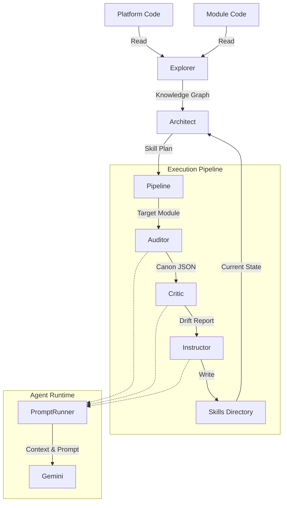

# Reskill System Specification

**Version**: 1.1.0
**Status**: Stable / Pro Implementation

## 1. Purpose

**Reskill** is an **Adaptive Learning System** for software projects. Its primary purpose is to decouple the "Intelligence" of a project from its "Implementation", allowing the codebase to "teach itself" how to grow.

In traditional development, "Best Practices" and "Architecture" are static documents that quickly rot. Reskill treats these as living **Skills** that must be continuously evolved by observing the actual code (The Kernel).

**Core Objectives:**

1.  **Automated Alignment**: Ensure "User Space" code (features/modules) stays aligned with "Kernel" code (platform/core).
2.  **Living Documentation**: Automatically generating and updating "Skill Definitions" (guides, templates, patterns) based on the latest source of truth.
3.  **Drift Detection**: Identifying when implementation diverges from the established patterns.

---

## 2. Architecture

Reskill operates on a cyclical **Evolutionary Loop**: `Explore -> Strategize -> Execute`.

### 2.1 The Components

1.  **The Explorer (Discovery)**
    - **Role**: The "Senses" of the system.
    - **Function**: Scans the configured `platformDirs` (Kernel) and `moduleDirs` (User Space). It maps the file structure, identifies emerging patterns, and builds a **Knowledge Graph**.
    - **Output**: `knowledge-graph.json`.

2.  **The Architect (Strategy)**
    - **Role**: The "Brain" of the system.
    - **Function**: Compares the **Knowledge Graph** against the **Current Skills** (bundled in `.reskill/skills`). It identifies gaps (missing skills), rot (outdated skills), and redundancy.
    - **Output**: A **Skill Plan** (`create`, `update`, `delete`, `merge`).

3.  **The Pipeline (Orchestration)**
    - **Role**: The "Nervous System".
    - **Function**: Manages the multi-stage execution flow for each skill in the **Skill Plan**.
    - **Stages**:
      - **Auditor**: Reads the "Truth" (Core Code) and extracts a **Canon** (Generic Rules/JSON).
      - **Critic**: Compares the **Canon** against the current **Skill Documentation**. Generates a **Drift Report**.
      - **Instructor**: precise edits to the **Skill Documentation** and **Templates** based on the Drift Report.

4.  **The Agent Runtime (Execution)**
    - **Role**: The "Hands" of the system.
    - **Component**: `AgentRunner` & `PromptRunner`.
    - **Function**: Executes specialized AI prompts using Nunjucks templating and LLM interaction (via Gemini).
    - **Capabilities**:
      - **Context Injection**: Uses `repomix` to inject codebase context directly into prompts.
      - **Model Rotation**: Automatically fails over between models (e.g., `gemini-3-flash`, `gemini-3-pro`).
      - **Interactive Mode**: Allows human-in-the-loop refinement.

### 2.2 Data Flow



---

## 3. Constraints

To function correctly, Reskill imposes the following constraints on the target codebase:

1.  **Distinct Kernel vs. User Space**: behavior must be separable into "Truth" (Core/Platform) and "Implementation" (Modules/Apps).
2.  **Constitution Files**: The system requires a `constitution.architecture` file (e.g., `ARCHITECTURE.md`) to ground its reasoning.
3.  **Structured Skills**: Skills are strictly organized as directories inside `.skills` folders in each project. They are aggregated into a flattened structure: `.reskill/skills/{project-name}-{skill}/SKILL.md`.
4.  **Agent Environment**: The system relies on `gemini` CLI being available in the environment (or mocked via `PromptRunner`).

---

## 4. Configuration

Reskill is configured via the `reskill` key in `nexical.yaml` (or the project's central configuration).

### Schema (`ReskillConfig`)

| Field                       | Type       | Description                                                                  |
| :-------------------------- | :--------- | :--------------------------------------------------------------------------- |
| `constitution`              | `object`   | References to global governance documents.                                   |
| `constitution.architecture` | `string`   | Path to the main architecture doc (required).                                |
| `constitution.patterns`     | `string`   | Path to the patterns/modules doc (optional).                                 |
| `discovery`                 | `object`   | Defines the scope of the scanner.                                            |
| `discovery.root`            | `string`   | Root directory to scan from. Default: `.`.                                   |
| `discovery.markers`         | `string[]` | Directory names that indicate a "Skill Project". Default: `['.skills']`.     |
| `outputs`                   | `object`   | Where to inject the skill index.                                             |
| `outputs.contextFiles`      | `string[]` | Files to update with the list of skills (e.g., `GEMINI.md`, `.cursorrules`). |
| `licenseKey`                | `string`   | (Optional) Key for Pro features (Watch mode).                                |

---

## 5. Extension

Reskill is designed to be extensible through **Prompt Overrides** and **Hooks**.

### 5.1 Dynamic Prompts

You can customize the "Personality" of the agents by overriding their system prompts.

1.  Create `.agent/prompts/agents/`.
2.  Add a markdown file matching the agent name (e.g., `auditor.md`, `architect.md`).
3.  Reskill will prioritize your local file over the bundled default.

### 5.2 The Hooks System (Pro)

The "Commercial Pro" tier enables the **Hooks System**, allowing plugins to react to lifecycle events.

**Location**: `src/core/Hooks.ts` (Internal API).

**Available Hooks**:

- `onDriftDetected(target, driftFile)`: Fired when the Critic finds discrepancies.
- `onSkillUpdated(target)`: Fired after the Instructor completes a rewrite.

---

## 6. Usage

Reskill automatically initializes its environment (scaffolds directories and copies prompts) on the first execution of any command.

### CLI Commands

#### `evolve`

Runs the full evolutionary loop.

```bash
nexical skill evolve
```

- Best for CI/CD pipelines or nightly builds.
- Updates all skills based on the current state of the Kernel.

#### `refine <skill> <module>`

Manually refine a specific skill using a specific module as the exemplar.

```bash
nexical skill refine "API Development" "apps/backend/modules/user"
```

- Best for "Golden Path" updates.

#### `watch` (Pro)

Runs as a daemon, watching for file changes.

```bash
nexical skill watch
```

- Requires `licenseKey`.
- Incrementally triggers drift detection when core files change.
